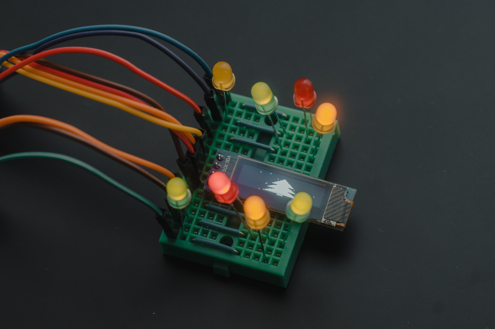

# XMAS-2024-OLED-LED

This tiny project is a festive display using an OLED screen and LEDs to create a Christmas-themed animation. The OLED screen shows a Christmas tree with falling snow, while the LEDs blink randomly to add to the festive atmosphere. :christmas_tree:



## How It Works

- The script initializes the I2C interface and the OLED display.
- It sets up the LEDs to blink randomly using separate threads.
- The OLED display shows a Christmas tree with falling snow particles.
- The snow particles move down and slightly sideways to create a falling effect.
- The display updates continuously in a loop until interrupted.

**Final result:**


## Components

- Raspberry Pi
- OLED display (128x32)
- LEDs (connected to GPIO pins 17, 27, 5, 6)
- Resistors for LEDs
- Breadboard and jumper wires

## Libraries

The following Python libraries are used in this project:

- `time`
- `random`
- `threading`
- `board`
- `busio`
- `PIL` (Pillow)
- `adafruit_ssd1306`
- `gpiozero`

## Setup

1. Connect the OLED display to the Raspberry Pi using I2C (SCL and SDA pins).
2. Connect the LEDs to the specified GPIO pins (17, 27, 5, 6) with appropriate resistors.
3. Install the required Python libraries:
    ```bash
    pip install adafruit-circuitpython-ssd1306 gpiozero pillow
    ```
4. Run the Python script:
    ```bash
    python xmas-2024-oled-led.py
    ```

## Merry Christmas! :christmas_tree: